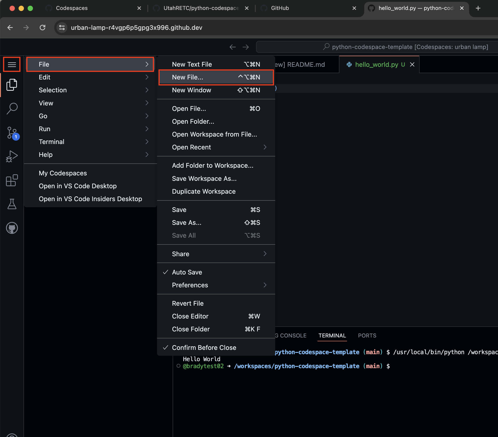

# Sign Up For Github And Setup Codespace

## 1. Create a github account

1. Go the following URL and create an account
	- https://github.com/signup?ref_cta=Sign+up&ref_loc=header+logged+out&ref_page=%2F&source=header-home

---

## 2. Sign in

Sign in to github at the following url: https://github.com

Fill out the forms 
- Choose 'just me' and 'student' for the first form
- Leave the second form blank and just click continue
- You will now be logged into the dashboard

---

## 3. Create the codespace

3.1 Navigate to the following url and click on 'use this template' then click on 'open in codespace': https://github.com/UtahRETC/python-codespace-template

**Wait for your codespace to be created:**

---

## 4. Congratulations! You have you're codespace set up

You can find this codespace later by going to the following url: https://github.com/codespaces

## Create your Python program

1. Create a new file in VS Code (you can do this by clicking on the button with the three lines on top left hand corner of the screen  and selecting "File" then “New File” and name it "hello_world.py").

2. Copy/paste (or better yet, type yourself) the following code into your new file: `print("Hello, World")`

## Run your Python program

1. Click on the “Run” button located on the top right hand corner of the VS Code window. Refer to arrow “E” in the image below for a reference on where this button is.
2. A new panel should open and you should see your program's output. Make sure you see “Hello, World” like on the image below.

