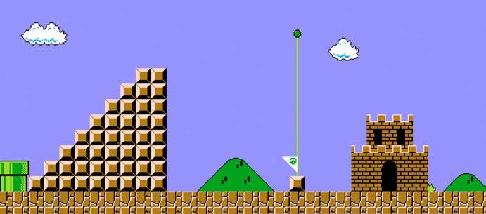

<!-- .slide: class="center" -->

# Introduction to Programming

### Unit 3: Loops, lists and hashes

---

<!--
paginate: true
footer: 'Unit 3: Loops, lists and hashes'
-->

We'll start with "loops".

---

Loops are all about repeating tasks.

---

Repeating tasks without having to repeat code.

---

In other words, loops allow your programs to execute parts of its code multiple times.

---

Some loops allow your programs to execute parts of its code forever.

---

Other loops allow your programs to execute parts of its code for each item in a list of items.

---

And others loops allow your programs to execute parts of its code until a condition is met.

---

One is correct depending on your situation.

---

"Keep putting frosting on the cupcakes until there are no cupcakes left."

---

"Keep brushing your teeth until you've brushed all of them."

---

"Keep asking the user for a number until they guess the one you're thinking of."

---

"Keep asking the user for a word until they guess the Wordle of the day."

---

## `while` loops

<span class="centered narrower">

<pre><code>while <span class="green">condition</span>:
    <span class="blue">code</span>
    <span class="blue">code</span>
</code></pre>

</span>

---

<span class="narrower center">

"Keep putting frosting on the cupcakes until there are no cupcakes left."

</span>

---

<span class="narrower center">

"Keep putting frosting on the cupcakes <span class="underline">while</span> there are cupcakes that don't have frosting on them yet."

</span>

---

<span class="narrower center">

"<span class="underline">While</span> there are cupcakes that don't have frosting on them yet, keep putting frosting on the cupcakes."

</span>

---

## `while` loops look like `if` statements

<span class="centered narrower">

<pre><code>while <span class="green">condition</span>:
    <span class="blue">code</span>
    <span class="blue">code</span>
</code>

<code>if <span class="green">condition</span>:
    <span class="blue">code</span>
    <span class="blue">code</span>
</code></pre>

</span>

---

## `while` statements

<span class="centered narrower">

<pre><code>code
code

while <span class="green">condition</span>:
    <span class="blue">code</span>
    <span class="blue">code</span>

code
code
</code></pre>

</span>

---

## Notice the indentation in this code

<span class="centered narrower">

<pre><code>code
code

while <span class="green">condition</span>:
<span class="red">····</span><span class="blue">code</span>
<span class="red">····</span><span class="blue">code</span>

code
code
</code></pre>

</span>

---

## Conditions in `while` loops

```python
user_input = int(input("Please enter a number between 1 and 10: "))

while user_input != number_to_guess:
    user_input = int(input("Please enter a number between 1 and 10: "))
```

---

## Multiple conditions in `while` loops

```python
user_input = int(input("Please enter a number between 1 and 10: "))

while user_input < 1 or user_input > 10:
    user_input = int(input("Please enter a number between 1 and 10: "))

print("Your number is " + str(user_input))
```

---

## Multiple conditions in `while` loops

```python
user_input = 0

while user_input < 1 or user_input > 10:
    user_input = int(input("Please enter a number between 1 and 10: "))

print("Your number is " + str(user_input))
```

---

## Number guessing game with multiple guesses

<span class="narrower center">

Let's update our Number Guessing Game programs so that they let the user continue making attempts at guessing the number until they get it right.

</span>

---

## Number guessing game with multiple guesses

<span class="centered">

<pre><code>while <span class="green">guess is incorrect</span>:
    <span class="blue">code</span>
</code></pre>

</span>

---

## Wordle with multiple attempts

<span class="narrower center">

Let's update our Wordle programs so that they let the user make up to 6 attempts at guessing the word.

</span>

---

## Wordle with multiple attempts

<span class="centered">

<pre><code>while <span class="green">guess is incorrect</span> <span class="bold">and</span> <span class="green">has taken less than 6 guesses</span>:
    <span class="blue">code</span>
</code></pre>

</span>

---

## Nested loops

<span class="narrower center">

A nested loop is simply a loop inside of another loop.

</span>

---

## Nested loops

<span class="narrower center">

Nested loops are useful when you are repeating an action that is based on another repeated action.

</span>

---

## Nested loops

<span class="narrower center">

For example, printing a grid with rows and columns.

</span>

---

# Grid with rows and columns

<span class="centered narrower">

```
while ...:
    while ...:
      print cell
```

</span>

---

## 5 by 5 grid of x's

<span class="center">

<pre class="raw fs-larger-2">X X X X X
X X X X X
X X X X X
X X X X X
X X X X X</pre>

</span>

---

## Let's write a program that prints the table below

<span class="center">
<pre class="raw fs-larger-1">X X X X X
X X X X X
X X X X X
X X X X X
X X X X X</pre>
</span>

<br>

<span class="centered">

- Print a table with 5 rows and 5 columns.
- Use two `while` loops.
- Hint: use `print("x", end="")` to print `"x"` without the new line.
- Hint: use `print("")` to print a new line.

</span>

---

## Mario's wall jump



---

## Mario's wall jump

<span class="center">

<pre class="raw fs-larger-2">#
##
###
####
#####
######
#######
########</pre>

</span>

---

## `for` loops

`for` loops are another way to loop in Python.

---

## `for` loops

It's easier to loop over a list using a `for` loop than a `while` loop.

---

## `for` loops

<span class="centered narrower">

<pre><code>for <span class="green">item</span> in <span class="green">items</span>:
    <span class="blue">code</span>
    <span class="blue">code</span>
</code></pre>

</span>

---

## Using a `for` loop with a string

```python
first_name = "Marcos"

for letter in first_name:
    print(letter)
```

---

## Using a `for` loop with a list

```python
names = [
    "Abdul", "Ahmed", "Chichi", "Cindy"
    "Cristina", "Daniel", "Dimanche", "Hala"
    "Halima", "Ikran", "Isnino", "Joanna"
    "Margarita", "Marta", "Mercina", "Milad"
    "Mohammad", "Mugisha", "Mussie", "Mustafa"
    "Mustafa", "Silvana", "Tresor", "Zalmay"
]

for name in names:
    print(name)
```

---

## Fizz buzz

<span class="centered">

- For the numbers from 1 to 100:
	- Print "Fizz" if the number is divisible by 3.
	- Print "Buzz" if the number is divisible by 5.
	- Print "FizzBuzz" if the number is divisible by both 3 and 5.
	- If the number is divisible by neither 3 nor 5, print the number itself.

</span>

---

# Lists

---

<span class="narrow center">
Lists are values that contain multiple values.
</span>

---

<span class="narrow center">
Lists <b>store</b> other values.
</span>

---

<span class="narrow center">
Lists are a data type in Python.
</span>

---

## We used a list in Wordle

```python
from random import choice

word_options = ["slurp", "video", "right", "rusty", "rhyme",
                "enter", "minty", "nurse", "print", "sandy"]
#
#                                  ^
#                                  |
#                                  |
#          a list of strings ------+

word_to_guess = choice(word_options)
print(word_to_guess)

user_input = input("Please enter a word: ")
number_of_guesses = 0
```

---

<span class="narrow center">
Lists let you keep values that represent the same thing together.
</span>

---

<span class="narrow center">
Using a list can be better than separate variables.
</span>

---

## Separate variables vs. lists

```python
# A word per variable
word_option_1 = "slurp"
word_option_2 = "video"
word_option_3 = "right"
# ...

# vs.

# All words in a single variable
word_options = ["slurp", "video", "right", "rusty", "rhyme",
                "enter", "minty", "nurse", "print", "sandy"]
```

---

<span class="narrow center">
Lots of functions work with lists, for example <code>random.choice</code>.
</span>

---

## Notice the square brackets and the commas

```python
word_options = ["slurp", "video", "right", "rusty", "rhyme",
                "enter", "minty", "nurse", "print", "sandy"]
```

---

## Lists can contain strings

```python
friends = [ "Alec", "Bekah", "Ryan", "Sam", "Sean" ]
```

---

## Lists can contain integers and floats

```python
ages = [ 26, 59, 35, 23 ]
```

---

## Lists can contain booleans

```python
enabled = [ True, False, True, True, False ]
```

---

## Lists can contain lists

```python
tic_tac_toe_matrix = [
  [ "X", " ", "O" ],
  [ " ", "X", "O" ],
  [ " ", " ", "X" ]
]
```

---

## Lists can contain a mix of data types

```python
users = [
  [ "Marcos", 33, False ],
  [ "Ryan", 39, False ],
  [ "Bekah", 36, True ]
]
```

---

## The three list operations you need to know about

<span class="centered">

- How to <b>access</b> an item in a list.
- How to <b>update</b> an item in a list.
- How to <b>add</b> an item to a list.

</span>

---

## How to "access" an item in a list

<span class="narrower center">
To "access" an item in a list means to get one of the values stored in the list.
</span>

---

## Accessing an item in a list

<span class="narrow center">
We use <code>[</code> <code>]</code> (square brackets) to access an item in a list, and we pass the index (<i>the position</i>) of the item we want to get.
</span>

---

## The index

<span class="narrower center">
"Index" means the position of the item in the list (eg, first, second, third, etc.)
</span>

---

## Accessing an item in a list

```python
word_options = ["slurp", "video", "right", "rusty", "rhyme",
                "enter", "minty", "nurse", "print", "sandy"]

print(word_options[0]) # prints slurp
print(word_options[1]) # prints video
print(word_options[5]) # prints enter
```

---

## Item index offsets

<span class="narrow center">
Notice that the first item in a list is in index 0.
</span>

---

## How to "update" an item in a list

<span class="narrower center">
Updating a item in a list means we're changing the value contained at a specific index.
</span>

---

## Update an item in a list

```python
word_options = ["slurp", "video", "right", "rusty", "rhyme",
                "enter", "minty", "nurse", "print", "sandy"]

print(word_options[5]) # prints enter

word_options[5] = "pizza"

print(word_options[5]) # prints pizza
```

---

## How to "add" an item to a list

<span class="narrower center">
Adding an item to a list means we're making the list bigger by adding a value to it.
</span>

---

## Adding an item to a list

```python
word_options = []

word_options.append("slurp")
word_options.append("video")
word_options.append("right")

print(word_options[1]) # prints video
```

---

## Adding an item to a list

<span class="narrow center">
Values are appended to the end of the list.
</span>

---

## Adding an item to a list

<span class="narrower center">
You can add an item to the beginning of a list, but we'll just stick with <code>append</code> for now.
</span>

---

## Looping over a list

```python
friends = [ "Alec", "Bekah", "Ryan", "Sam", "Sean" ]

for friend in friends:
    print(friend)
```

---

<span class="center narrower">

`break` and `continue` are statements that give us additional control over how loops work.

</span>

---

`break` is used to stop the loop.

---

<span class="center narrower">

A `while` loop will stop when its condition is `False`, `break` lets us do the same.

</span>

---

`continue` is used skip to the next iteration.

---

## `break` and `continue` example

<span class="centered narrower">

<pre><code>while True:
    if <span class="green">the player has won the game</span>:
        print("You win!")
        <span class="blue">break</span>
</code></pre>

</span>

---

## `break` and `continue` example

<span class="centered narrower">

<pre><code>while True:
    if <span class="green">this is an item we want to skip</span>:
        <span class="blue">continue</span>
</code></pre>

</span>

---
